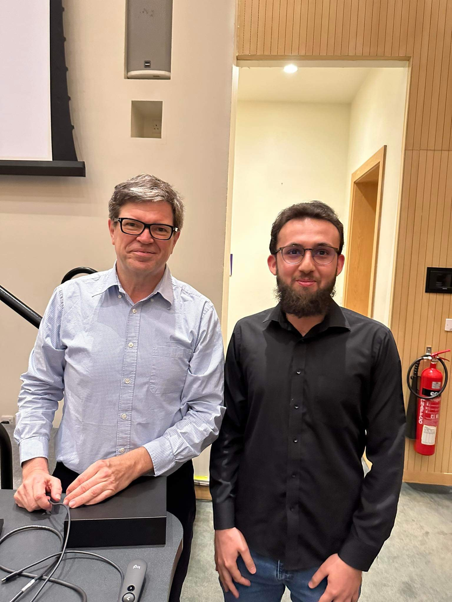
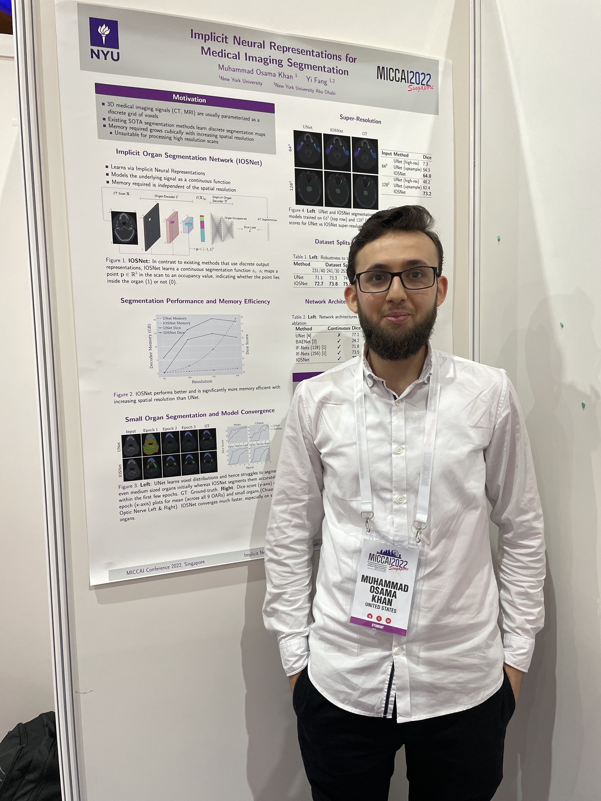
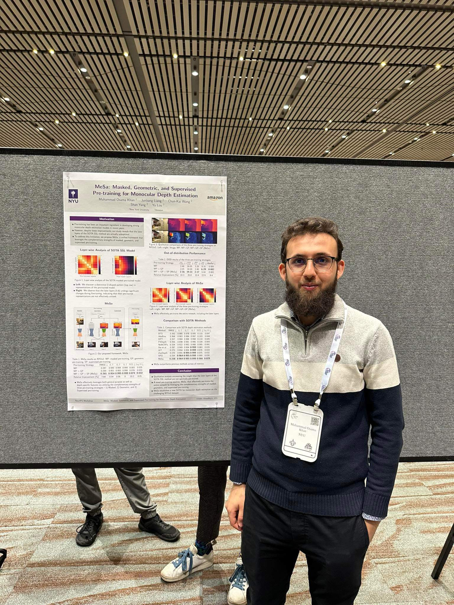
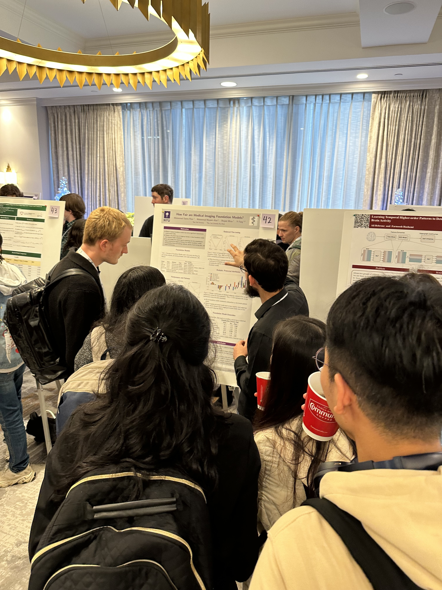
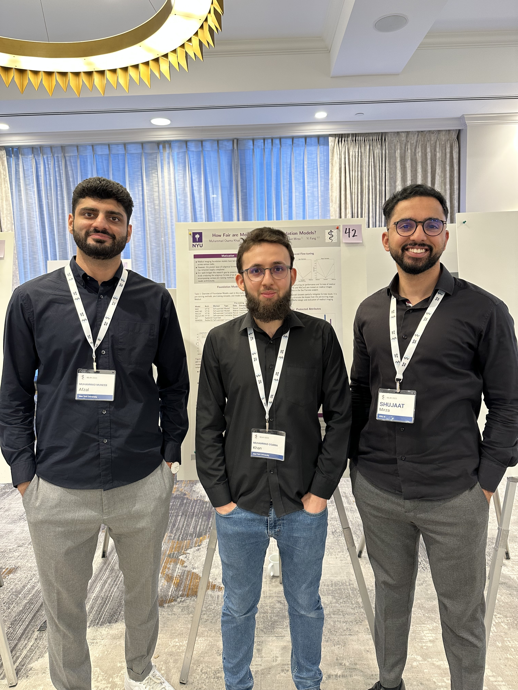
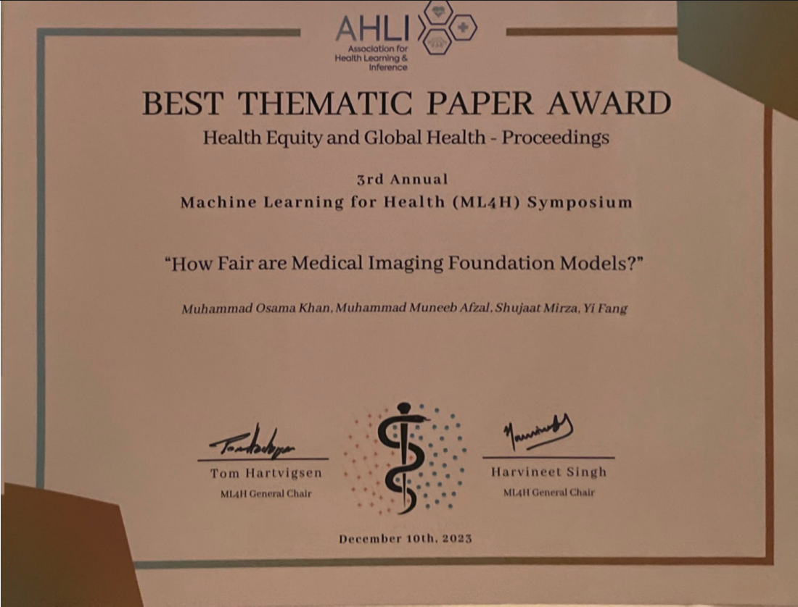

##### About Me
* * *

I am an Applied Scientist at Amazon in Seattle, where I work on developing foundation models and multi-modal LLMs for the world’s largest fulfillment network. My research broadly lies at the intersection of computer vision, generative AI, and responsible AI, with a particular emphasis on foundation models, self-supervised learning, medical imaging, and fairness.

Previously, I completed my PhD in Computer Science at [New York University](https://www.nyu.edu/) as a Global PhD Fellow. My doctoral work was recognized with a Best Paper Award at ML4H as well as a nomination for the Pearl Brownstein Doctoral Research Award. During my PhD, I collaborated with the [Harvard Ophthalmology AI Lab](https://ophai.hms.harvard.edu/) on a range of research problems including vision-language foundation models and medical diffusion models. I also had the opportunity to gain valuable industry and academic experience through internships and summer schools at [Amazon](https://www.amazon.com/visual-search/), [Cambridge](https://www.vanderschaar-lab.com/ccaim-ai-and-machine-learning-summer-school/), and [Oxford](https://www.oxfordml.school/).

My research has been published in several prestigious venues including CVPR, ECCV, Science Advances, MICCAI, and MIDL. Prior to my PhD, I earned a B.S. in Electrical Engineering from NYU Abu Dhabi, graduating **summa cum laude**.

##### Research Interests
* * *

  <ul style="list-style-type: disc;">
    <li>Foundation Models</li>
    <li>Multi-modal LLMs</li>
    <li>Diffusion Models</li>
  </ul>
  <ul style="list-style-type: disc;">
    <li>Computer Vision</li>
    <li>Medical Imaging</li>
    <li>Responsible AI</li>
  </ul>

##### Education
* * *

**New York University**  
PhD, Computer Science, 2024      
*Awards:* Global PhD Fellowship, Best PhD Thesis Nomination, Best Paper Award 

**New York University Abu Dhabi**  
B.S, Electrical Engineering, 2019 (GPA: 4.0/4.0)  
*Study Abroad:* New York, London, Sydney, Thailand\
*Awards:* Summa cum laude, Full undergraduate scholarship, Silver medalist (iGEM)

##### Select Publications
* * *

* [FairDiffusion: Enhancing Equity in Latent Diffusion Models via Fair Bayesian Perturbation](https://www.science.org/doi/10.1126/sciadv.ads4593)\\
  Y Luo\*, *MO Khan*\*, C Wen\* et al. In Science Advances.

* [FairCLIP: Harnessing Fairness in Vision-Language Learning](https://openaccess.thecvf.com/content/CVPR2024/papers/Luo_FairCLIP_Harnessing_Fairness_in_Vision-Language_Learning_CVPR_2024_paper.pdf) 
  Y Luo\*, M Shi\*, *MO Khan*\* et al. In CVPR.

* [MeSa: Masked, Geometric, and Supervised Pre-training for Monocular Depth Estimation](https://proceedings.mlr.press/v243/khan24a/khan24a.pdf) 
  *MO Khan*, J Liang, CK Wang et al. In NeurIPS (UniReps).

* [Implicit Neural Representations for Medical Imaging Segmentation](https://link.springer.com/chapter/10.1007/978-3-031-16443-9_42) 
  *MO Khan*, and Y Fang. In MICCAI.

* [How Fair are Medical Imaging Foundation Models?](https://proceedings.mlr.press/v225/khan23a/khan23a.pdf) \\
  *MO Khan*, MM Afzal, S Mirza, and Y Fang. In Machine Learning for Health (ML4H).

* [What Is the Best Way to Fine-Tune Self-supervised Medical Imaging Models?](https://link.springer.com/chapter/10.1007/978-3-031-66955-2_19) 
  *MO Khan*, and Y Fang. In Medical Image Understanding and Analysis (MIUA).

* [FairDomain: Achieving Fairness in Cross-Domain Medical Image Segmentation and Classification](https://arxiv.org/pdf/2407.08813)\\
Y Tian\*, C Wen\*, M Shi\*, MM Afzal, H Huang, *MO Khan* et al. In ECCV.

* [A Comprehensive Benchmark of Supervised and Self-supervised Pre-training on Multi-view Chest X-ray Classification](https://openreview.net/pdf?id=YUMVjxdIqn)\\
  MM Afzal\*, *MO Khan*\*, and Y Fang. In Medical Imaging with Deep Learning (MIDL).

<!-- * [Towards Equitable Kidney Tumor Segmentation: Bias Evaluation and Mitigation.](https://proceedings.mlr.press/v225/afzal23a/afzal23a.pdf)\\
  Muhammad Muneeb Afzal, *Muhammad Osama Khan*, Shujaat Mirza. In Machine Learning for Health (ML4H), 2023. -->

<!-- * [Equitable deep learning for diabetic retinopathy detection with fair adaptive scaling.](https://osamakhaan.github.io)\\
  Min Shi\*, *Muhammad Muneeb Afzal*\*, Hao Huang\* et al.. In Nature Machine Intelligence (In Review), 2024. -->

##### Gallery
* * *

<!-- 3x2 Image Grid (using only .jpg images) -->

  
  
  
  
  
  

